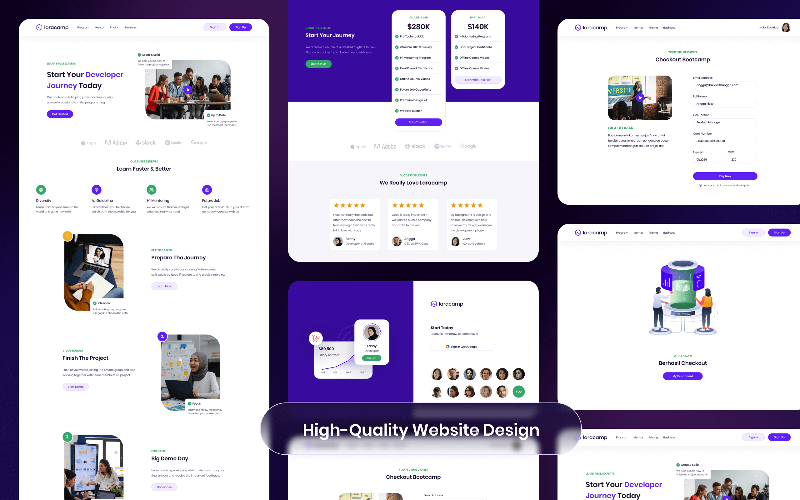

<div id="top"></div>


<!-- PROJECT LOGO -->
<br />
<div align="center">
  <a href="https://github.com/darmawan21/laracamp">
    
  </a>

<h3 align="center">Laracamp</h3>

  <p align="center">
    A bootcamp website for developers
    <br />
    <a href="https://github.com/darmawan21/laracamp"><strong>Explore the docs »</strong></a>
    <br />
    <br />
    <a href="https://laracamp.id/">View Demo</a>
    ·
    <a href="https://github.com/darmawan21/laracamp/issues">Report Bug</a>
    ·
    <a href="https://github.com/darmawan21/laracamp/issues">Request Feature</a>
  </p>
</div>


<!-- TABLE OF CONTENTS -->
<details>
  <summary>Table of Contents</summary>
  <ol>
    <li>
      <a href="#about-the-project">About The Project</a>
      <ul>
        <li><a href="#built-with">Built With</a></li>
      </ul>
    </li>
    <li>
      <a href="#getting-started">Getting Started</a>
      <ul>
        <li><a href="#prerequisites">Prerequisites</a></li>
        <li><a href="#installation">Installation</a></li>
      </ul>
    </li>
    <li><a href="#usage">Usage</a></li>
    <li><a href="#roadmap">Roadmap</a></li>
    <li><a href="#contributing">Contributing</a></li>
    <li><a href="#license">License</a></li>
    <li><a href="#contact">Contact</a></li>
  </ol>
</details>


<!-- ABOUT THE PROJECT -->
## About The Project

[![Product Name Screen Shot][product-screenshot]](https://github.com/darmawan21/laracamp/blob/main/public/images/Cover.png)
<a href="https://github.com/darmawan21/laracamp">
    
</a>

So far, many prospective developers have studied in an unstructured and undirected way that relies on many sources of information, in this case many developers are confused about where to start and unwittingly a lot of time is wasted. Laracamp offers alternative solutions that allow developers to learn in a structured and directed manner through the bootcamp available on the Laracamp website.

<p align="right">(<a href="#top">back to top</a>)</p>


### Built With

* [Laravel](https://laravel.com)
* [Bootstrap](https://getbootstrap.com)

<p align="right">(<a href="#top">back to top</a>)</p>


<!-- GETTING STARTED -->
## Getting Started

To get a local copy up and running follow these steps.

### Prerequisites

A few resources to get you started if this your firt Laravel Project

- [Install your Laravel](https://laravel.com/docs/8.x/installation)
- [Install Composer](https://getcomposer.org/download/) 

### Installation

1. Create and get API Key Credentials Oauth Goolge Account (https://https://console.cloud.google.com/apis/dashboard)
2. Create and get Key Midtrans Payment Gateway (https://midtrans.com/)
3. Clone the repo
   ```sh
   git clone https://github.com/darmawan21/laracamp.git
   ```
4. Install Depedency
   ```sh
   composer install
   ```
5. Setup Environmetn Variable
   ```sh
   cp .env.example .env
   ```
6. Enter your APP_KEY if it's not already in the `.env` file
   ```sh
   php artisan key:generate
   ```
7. customize your database name in file `.env`
8. Enter your Oauth Google Account API in `.env`
   ```sh
   GOOGLE_CLIENT_ID= YOUR API KEY 
   GOOGLE_CLIENT_SECRET= YOUR API KEY 
   GOOGLE_CLIENT_REDIRECT= YOUR API KEY 
   ```
9. Enter your Midtrans Payment Gateway API in `.env`
   ```sh
   MIDTRANS_SERVERKEY = YOUR API KEY
   MIDTRANS_CLIENTKEY = YOUR API KEY
   ```
10. Migrate and Seed
    ```sh
    php artisan migrate --seed
    ```
11. Run Local Dev Server
    ```sh
    php artisan serve
    ```


<p align="right">(<a href="#top">back to top</a>)</p>


<!-- USAGE EXAMPLES -->
## Usage

[![Cover Laracamp][product-screenshot]](https://github.com/darmawan21/laracamp/blob/main/public/images/Cover.png)
[![Laracamp Page][product-screenshot]](https://github.com/darmawan21/laracamp/blob/main/public/images/laracamp-page.png)

<a href="https://github.com/darmawan21/laracamp">
    
</a>
<a href="https://github.com/darmawan21/laracamp">
    
</a>

For more examples can open website [Laracamp](https://laracamp.id/)

<p align="right">(<a href="#top">back to top</a>)</p>


<!-- ROADMAP -->
## Roadmap

- [X] Add Oauth Google Account
- [X] Add Email Integration
- [X] Add Payment Gateway

See the [open issues](https://github.com/darmawan21/laracamp/issues) for a full list of proposed features (and known issues).

<p align="right">(<a href="#top">back to top</a>)</p>


<!-- CONTRIBUTING -->
## Contributing

Contributions are what make the open source community such an amazing place to learn, inspire, and create. Any contributions you make are **greatly appreciated**.

If you have a suggestion that would make this better, please fork the repo and create a pull request. You can also simply open an issue with the tag "enhancement".
Don't forget to give the project a star! Thanks again!

1. Fork the Project
2. Create your Feature Branch (`git checkout -b feature/AmazingFeature`)
3. Commit your Changes (`git commit -m 'Add some AmazingFeature'`)
4. Push to the Branch (`git push origin feature/AmazingFeature`)
5. Open a Pull Request

<p align="right">(<a href="#top">back to top</a>)</p>


<!-- LICENSE -->
## License

Distributed under the MIT License. See `LICENSE.txt` for more information.

<p align="right">(<a href="#top">back to top</a>)</p>


<!-- CONTACT -->
## Contact

Muhammad Diki Darmawan - [@ddrwwn](https://twitter.com/ddrwwn) - [LinkedIn](https://linkedin.com/in/muhammad-diki-darmawan-95528841a1) - d.darmawan2111@gmail.com

Project Link: [https://github.com/darmawan21/laracamp](https://github.com/darmawan21/laracamp)

<p align="right">(<a href="#top">back to top</a>)</p>


<!-- MARKDOWN LINKS & IMAGES -->
<!-- https://www.markdownguide.org/basic-syntax/#reference-style-links -->
[contributors-shield]: https://img.shields.io/github/contributors/github_username/repo_name.svg?style=for-the-badge
[contributors-url]: https://github.com/darmawan21/laracamp/graphs/contributors
[forks-shield]: https://img.shields.io/github/forks/github_username/repo_name.svg?style=for-the-badge
[forks-url]: https://github.com/darmawan21/laracamp/network/members
[stars-shield]: https://img.shields.io/github/stars/github_username/repo_name.svg?style=for-the-badge
[stars-url]: https://github.com/darmawan21/laracamp/stargazers
[issues-shield]: https://img.shields.io/github/issues/github_username/repo_name.svg?style=for-the-badge
[issues-url]: https://github.com/darmawan21/laracamp/issues
[license-shield]: https://img.shields.io/github/license/github_username/repo_name.svg?style=for-the-badge
[license-url]: https://github.com/darmawan21/laracamp/blob/master/LICENSE.txt
[linkedin-shield]: https://img.shields.io/badge/-LinkedIn-black.svg?style=for-the-badge&logo=linkedin&colorB=555
[linkedin-url]: https://linkedin.com/in/linkedin_username
[product-screenshot]: images/screenshot.png